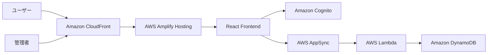

```mermaid
graph LR
    A[ユーザー] --> B[Amazon CloudFront]
    B --> C[AWS Amplify Hosting]
    C --> D[React Frontend]
    D --> E[Amazon Cognito]
    D --> F[AWS AppSync]
    F --> G[AWS Lambda]
    G --> H[Amazon DynamoDB]
    I[管理者] --> B
```