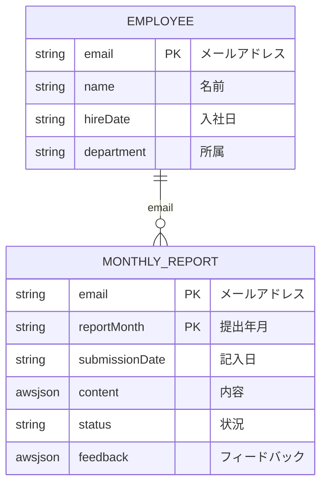

```mermaid
erDiagram
    EMPLOYEE{
        string email PK "メールアドレス"
        string name "名前"
        string hireDate "入社日"
        string department "所属"
    }

    MONTHLY_REPORT {
        string email PK "メールアドレス"
        string reportMonth PK "提出年月"
        string submissionDate "記入日"
        awsjson content "内容"
        string status "状況"
        awsjson feedback "フィードバック"
    }

    EMPLOYEE ||--o{ MONTHLY_REPORT : "email"
```