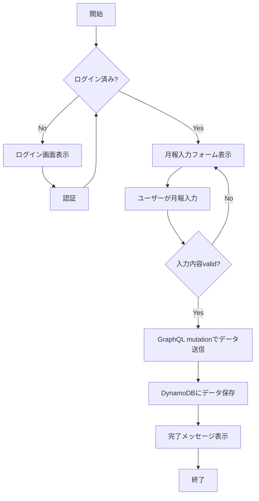

```mermaid
graph TD
    A[開始] --> B{ログイン済み?}
    B -- No --> C[ログイン画面表示]
    C --> D[認証]
    D --> B
    B -- Yes --> E[月報入力フォーム表示]
    E --> F[ユーザーが月報入力]
    F --> G{入力内容valid?}
    G -- No --> E
    G -- Yes --> H[GraphQL mutationでデータ送信]
    H --> I[DynamoDBにデータ保存]
    I --> J[完了メッセージ表示]
    J --> K[終了]
```