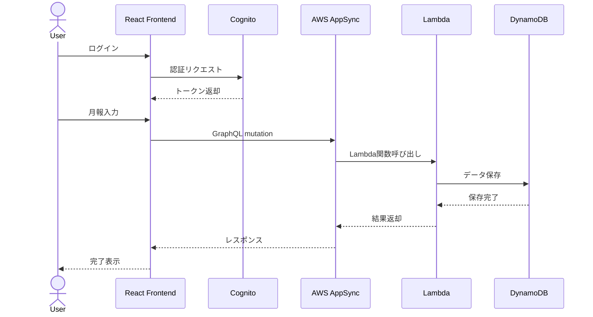

```mermaid
sequenceDiagram
    actor User
    participant Frontend as React Frontend
    participant Cognito
    participant AppSync as AWS AppSync
    participant Lambda
    participant DynamoDB

    User->>Frontend: ログイン
    Frontend->>Cognito: 認証リクエスト
    Cognito-->>Frontend: トークン返却
    User->>Frontend: 月報入力
    Frontend->>AppSync: GraphQL mutation
    AppSync->>Lambda: Lambda関数呼び出し
    Lambda->>DynamoDB: データ保存
    DynamoDB-->>Lambda: 保存完了
    Lambda-->>AppSync: 結果返却
    AppSync-->>Frontend: レスポンス
    Frontend-->>User: 完了表示
```